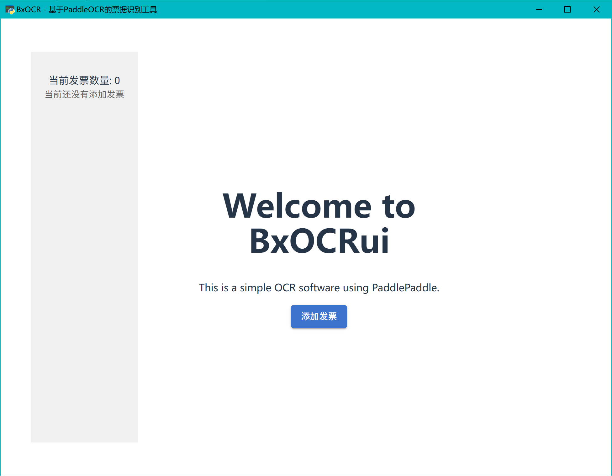
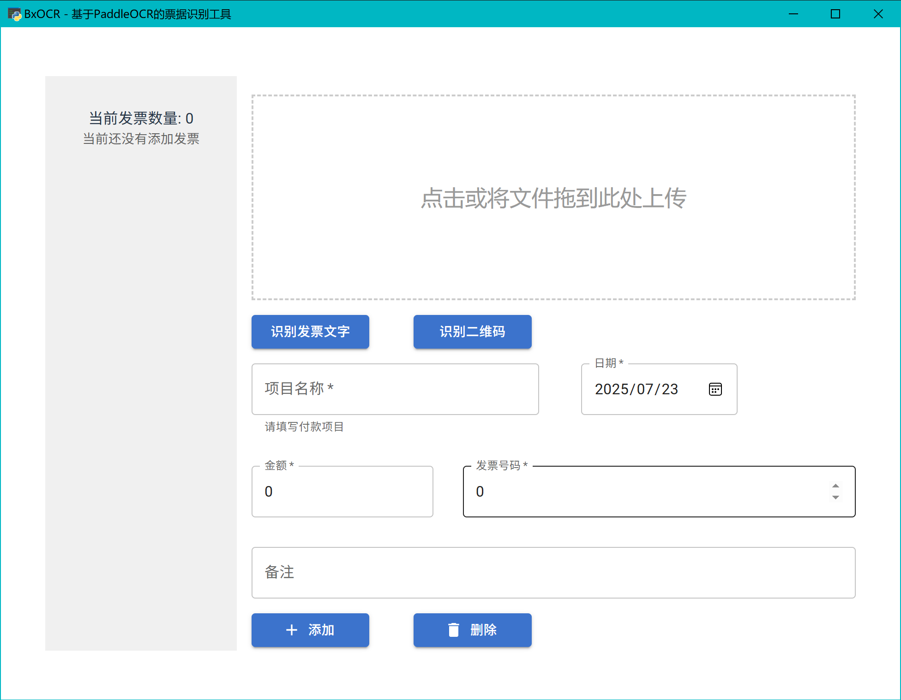

# BaoxiaoOCR

BaoxiaoOCR是一款用于识别发票内容以及提取发票信息的小工具





本项目使用 PaddlePaddleOCR 以及 LLM 对发票图片的内容进行识别并提取出关键信息。

本项目基于 pywebview 构建。前端使用`React19` + `vite`构建页面，并通过 WSGI 进行访问。后端使用 [Javascript–Python bridge](https://pywebview.flowrl.com/guide/usage.html#communication-between-javascript-and-python) 进行通信(这相当于直接用 JS/TS 调用 python 函数，而不是通过http协议访问后端 api server)。

## 开发

### webview

由于 pywebview 默认使用`edgechromium`作为[引擎](https://pywebview.flowrl.com/guide/web_engine.html)，在 windows 平台你可能需要安装[Microsoft Edge WebView2](https://developer.microsoft.com/zh-cn/microsoft-edge/webview2#download)作为其依赖。

### 配置

`PaddleOCR.yaml`文件为PaddleX管道配置，详情参见[PaddleX文档](https://paddlepaddle.github.io/PaddleX/latest/)。

`config.yaml`文件为大模型配置，默认的配置是调用本地ollama。你可以在ollama使用以下指令快速安装运行。

```bash
ollama pull qwen2.5:0.5b
ollama pull zyw0605688/gte-large-zh:latest
ollama pull qwen2.5vl:7b

# 允许任意源
set OLLAMA_ORIGINS=* 

# 启动ollama服务器
ollama serve
```

若本地不便部署大模型，也可以选用第三方的api服务。

### 构建

本项目使用[`uv`](https://docs.astral.sh/uv/)作为Python的包管理器，你可以使用如下命令快速配置Python依赖。

```bash
# 如果你还没有uv，可以通过pip安装他
pip install uv

# 创建虚拟环境并安装依赖
uv sync

# 开始运行
uv run python main.py
```

#### 编译前端

```bash
cd front-end
pnpm install && pnpm build
```

#### 编译后端

```
pip install uv
uv sync
uv run pyinstall main.spec
cp -r front-end/* dist/main/front-end
```

或者你也可以参考附带的`build.bat`脚本。
